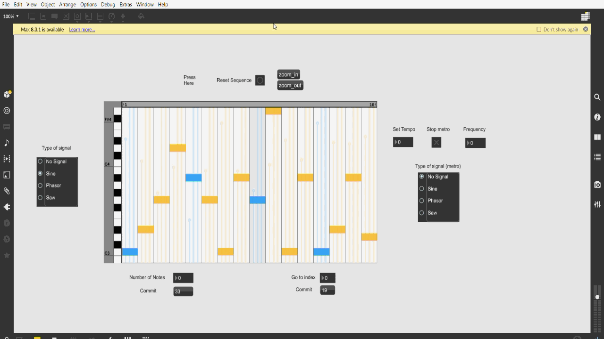

# Rhythm MIDI Sequence
Acest patch permite utilizatorului sa introduca o secventa de note,
pe care le poate canta la tempo ul dorit, cat de repede sau incet doreste.

## Instalare
Dupa ce se instaleaza programul Cycling Max, tot ce trebuie facut este sa descarcati patch-ul "proiect_MAX_ver 1.0" si sa-l porniti.

## Utilizare
Selectare semnal dorit:

Play:

Reset:

Zoom:

Selectare numar de note dorite:

Mergi la a X-a nota:

Seteaza tempo si frecventa metronomului:

Porneste Metronom:

## Istoric

(01.06.2022) proiect_MAX_ver 1.0

## Exemple cu patch-ul in actiune

https://drive.google.com/file/d/1zPMElwgoH7_4PJUpB0HRgnYuxtVDI6n8/view?usp=sharing
https://drive.google.com/file/d/15_H9PFMjFlsA2ns5vw_jC-2FSmj49jwC/view?usp=sharing

